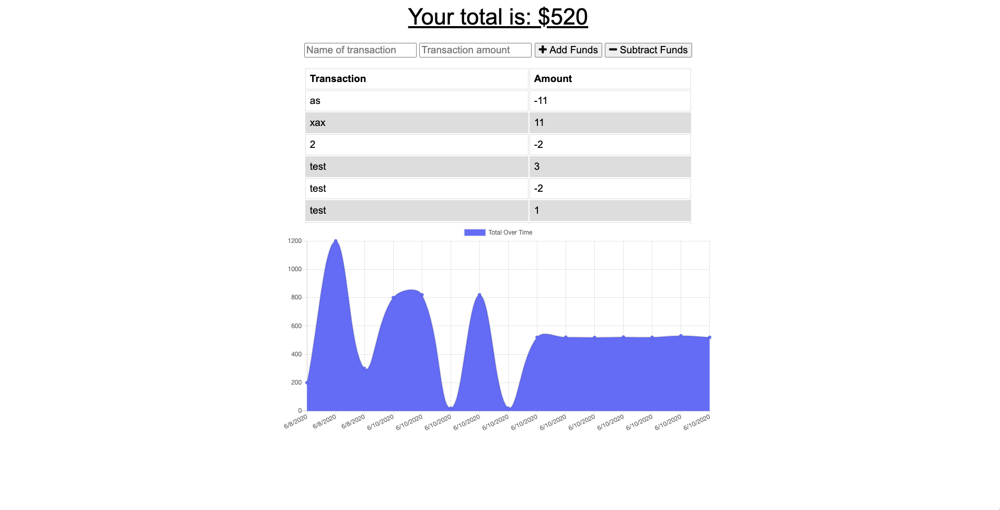
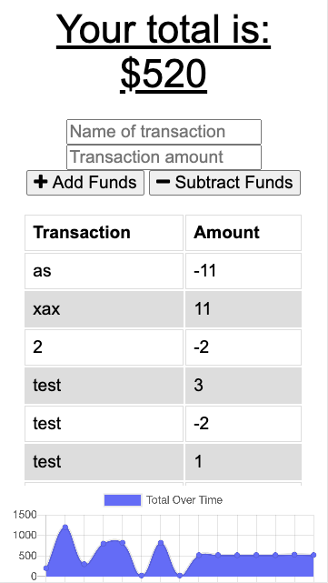

<h1 align= "center">Under Control</h1> 
<h2>Live Link</h2>
<h3><a href= "https://under-control.herokuapp.com/">Live Link</a></h3>  
<h2> Table of Contents </h2>
<li><a href="#description">Description</a></li>  
<li><a href="#installation">Installation</a></li> 
<li><a href="#tech">Technology Stack</a></li> 
<li><a href="#usage">Usage</a></li> 
<li><a href="#screen">ScreenShots</a></li> 
<li><a href="#test">Test</a></li>
<li><a href="#contributors">Contributors</a></li>   
<li><a href="#contact">Contact</a></li> 
<h2 id="description"> Description </h2>

Application created to track  finances online and offline
   
<h2 id="installation"> Installation </h2>

JSON packages included. Just run npm i
          
<h2 id="tech"> Technology Stack </h2>          

Node, HTML, CSS, JavaScript, Mongodb, Mongoose.
          
<h2 id="usage"> Usage </h2>
<ol>
<li>Insert the name of the transaction</li>
<li>Insert the amount of the transaction</li>
<li>Click if is adding or Subtracting transaction</li>
<li>See the graphic of how you are doing</li>
<li>Even  offline all the transitions will be capture and saved when back online. </li>
</ol>   
<h2 id="screen"> ScreenShoots </h2>
<h3>Desktop</h3>

<h3>Mobile</h3>

<h2 id="test"> Test </h2>
<h3>Online</h3>

<h3>Offline</h3>

<h2 id="contributors"> Contributors </h2>

<a href= "https://github.com/chaalexander">@chaalexander</a>
 
<h2 id="contact"> Contact </h2>         
<h5> Name: Charlenne Alexander </h5>       
<h5><a href= "https://github.com/chaalexander">GitHub</a></h5>  
<h5><a href= "https://chaalexander.github.io/">Portfolio</a></h5>  
<h5><a href= "mailto:charlennep@gmail.com">charlennep@gmail.com</a></h5>       
<h5><a href= "https://www.linkedin.com/in/cha-alexander">LinkedIn</a></h5>
